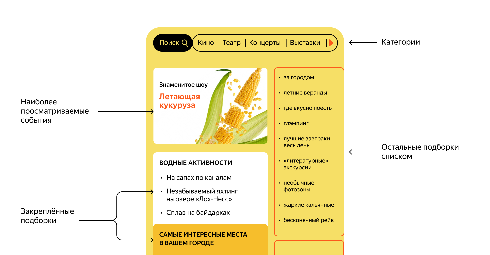
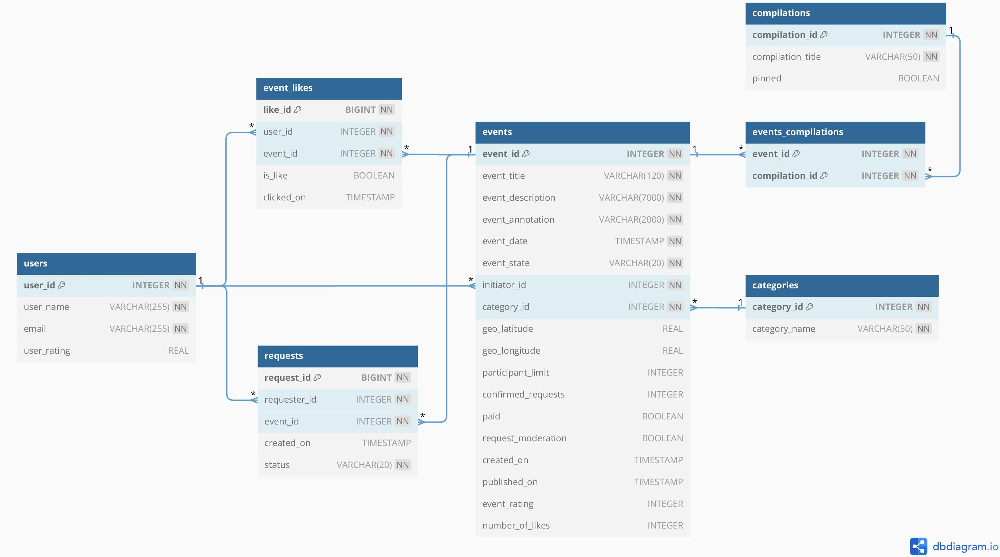

[English](..%2FREADME.md)

# Explore with me

---
*Бэкенд сервиса, позволяющего пользователям делиться информацией об интересных событиях и находить компанию для участия в них.*

---
Организовать мероприятие, на которое требуется собрать компанию друзей или просто заинтересованных людей - не простая задача.
Данное приложение-афиша может помочь - агрегировать в одном месте информацию о намечающемся событии, понять насколько оно популярно,
собрать компанию для его проведения, оценить идею и то, как она была реализована.

Вариант оформления фронтенда приложения:


---
Это приложение имеет три уровня взаимодействия с пользователями:

Публичный - доступен без регистрации любому пользователю сети, предоставляет возможности:

  1. Просматривать список событий с поддержкой поиска и фильтрации (количество просмотров, дата события, категория и подборки событий);
  2. Просматривать подробную информацию о мероприятии.

Закрытый - доступен только авторизованным пользователям, предоставляет возможности:

  1. Добавлять в приложение новые мероприятия, редактировать их и просматривать после добавления;
  2. Оценивать идею проведения мероприятия (которое еще не произошло) или то, как оно было проведено;
  2. Подавать заявки на участие в интересующих мероприятиях;
  3. (для организаторов мероприятий) Подтверждать заявки, которые отправили другие пользователи сервиса.

Административный - доступен пользователям администраторам, предоставляет возможности настройки и поддержки работы сервиса:
  1. Управление пользователями — добавление, активация, просмотр и удаление;
  2. Модерация событий, размещённых пользователями — публикация или отклонение;
  3. Управление подборками - добавлять, удалять и закреплять на главной странице подборки мероприятий;
  4. Управление категориями - добавлять, изменять и удалять категории для событий.
---
Версия Java - 11;

Приложение основано на фреймворке Spring Boot v. 2.7.9;

Система сборки - Apache Maven;

База данных - PostgreSQL;

Обращение к БД и мэппинг сущностей - spring-boot-starter-data-jpa, hibernate;

Тестирование - JUnit, Mockito;

Система контейнеризации - Docker + docker-compose.


Сервис разделен на 2 модуля:

stats_service - в собственной базе данных хранит статистику просмотров на основе количества кликов пользователей по ссылкам мероприятий, 
позволяет получать выборки для анализа работы приложения, содержит подмодуль-клиент, для удобного встраивания в код.

main_service - содержит все необходимое для работы продукта, принимает запросы пользователей, валидирует и обрабатывает их, 
обращается к основной базе данных для предоставления ответов пользователю.

---

Инструкция по запуску приложения локально:
1. Для запуска приложения необходимо программное обеспечение
- Git (вариант гайда по установке - https://learn.microsoft.com/ru-ru/devops/develop/git/install-and-set-up-git);
- JDK (java SE11+, вариант гайда по установке - https://blog.sf.education/ustanovka-jdk-poshagovaya-instrukciya-dlya-novichkov/);
- Apache Maven (вариант гайда по установке на Windows - https://byanr.com/installation-guides/maven-windows-11/);
- Docker (& docker-compose) - для работы в среде Windows понадобится виртуальная машина с ОС Linux -
  вариант гайда по ее установке - https://learn.microsoft.com/ru-ru/windows/wsl/install.
2. После запуска приложение будет принимать http-запросы в соответствии с API (см. ниже) на порт 8080 (http://localhost:8080/), 
а также отправлять данные в модуль сервиса статистики на порт 9090 (http://localhost:9090/), убедитесь, что порты свободны, 
в противном случае необходимо будет поменять соответствующие настройки в файлах application.properties и docker-compose.yml
3. Запустить терминал/командную строку/PowerShell, выполнить поочерёдно команды, дождавшись завершения каждой:
```
cd {целевая директория для загрузки проекта}

git clone git@github.com:RuslanYapparov/java-explore-with-me.git

cd java-explore-with-me/

mvn package

docker-compose up  

```
4. Для запуска тестового сценария можно воспользоваться коллекцией тестов (см. ниже). 
---

Описание API (OpenAPI):

сервис статистики - [ewm-stats-service-spec.json](ewm-stats-service-spec.json)

главный сервис - [ewm-main-service-spec.json](ewm-main-service-spec.json)

для просмотра необходимо скопировать и открыть содержимое в Swagger editor

---

Коллекция тестов Postman:

сервис статистики - [explore-with-me_stats-service-test_postman-collection.json](explore-with-me_stats-service-test_postman-collection.json)

главный сервис - [explore-with-me_main-service-test_postman-collection.json](explore-with-me_main-service-test_postman-collection.json)

функциональность лайков и рейтингов - [explore-with-me_rating-feature-test_postman-collection.json](explore-with-me_rating-feature-test_postman-collection.json)

импортировать коллекцию, скопировав содержимое в поле как Raw-текст

---

База данных приложения спроектирована в соответствии с ER-диаграммой (облегченная версия, создана с помощью dbdiagram.io):



---


Приложение написано на языке Java. Пример кода:
```java
public class ExploreWithMe {
    public static void main(String[] args) {
        System.out.println("Let's start attracting people to our events!");
    }
}
```